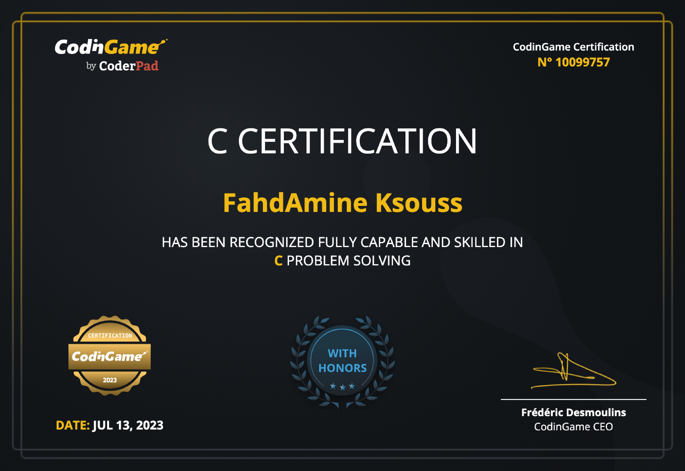
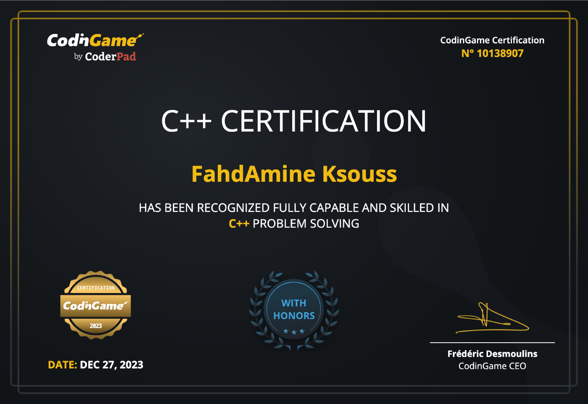

 

<h1 align="left">Hi 👋! My name is Fahd and I'm a Software engineer student from Morocco</h1>

###

 

###

###
# Tech🖥️:

  
  
  
  
  
  
  
  
  
  
  
  
  
  
  
  
  
  
  
  
  
  
  
  
  

  
  
  
  
  
  
  
  

  
  
  
  
  
  
  
  
  

###
# Where to reach me:

  
  
  

###

  

###

### ✍️ Random Dev Quote

---

<!-- Proudly created with GPRM ( https://gprm.itsvg.in ) -->
<!-- # certifs 📜:

  
  
  

-->
<!--

-->
